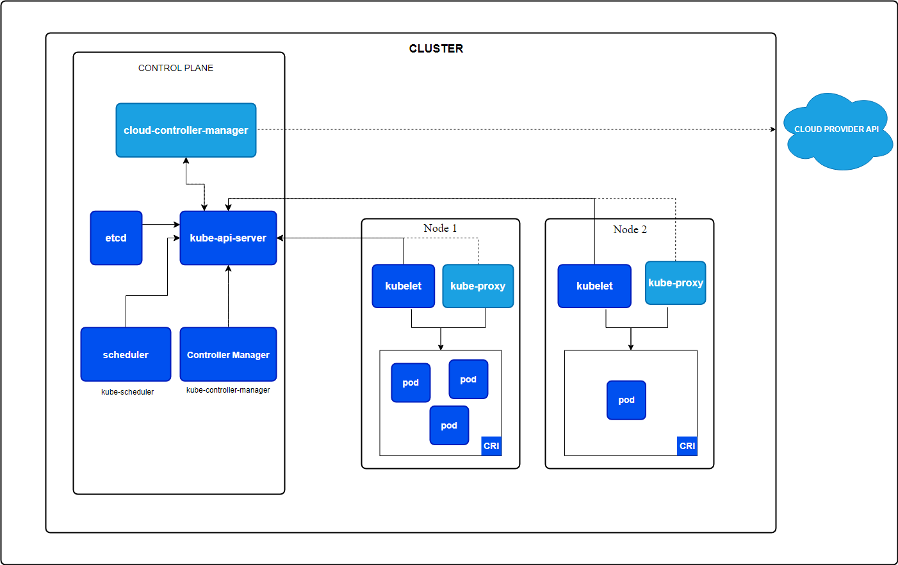
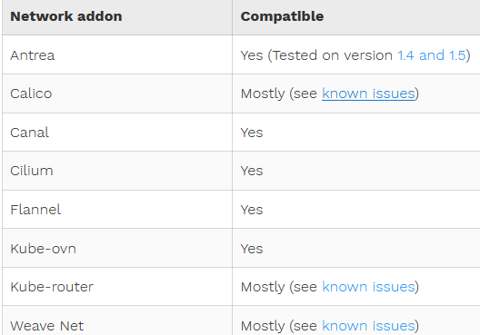
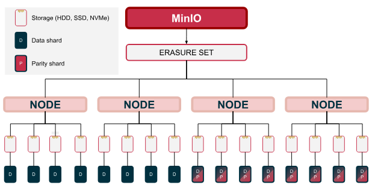
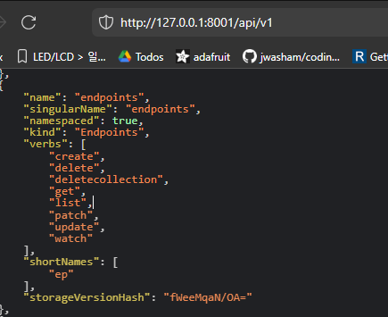

<div align="center">


😁 The best, no doubt</br>
</div>

---

### Table of Contents
- [Kube In General](#kubernetes-in-general)
  - [Resources](#resources)
  - [Architecture](#architecture)
- [Experiments](#experiments)
  - [Environment](#environment)
  - [Overview](#setup-overview)
  - [The Backbone](#the-backbone)
  - [Joining](#joining-a-node)
  - [Deploying](#ready-to-deploy)
- [Addendum](#addendum)
  - [Todos](#todos)
  - [Custom Init](#i-custom-init-config)
  - [UFW Migration](#ii-migrating-ufw-rules)
  - [Cluster Control](#iii-node-control)
  - [Reset](#iv-resetting)

*WIP*
# Kubernetes in General
I'm not an expert nor am I here to teach!</br>
This doc, in its entirety, is to serve as a self-reminder!
## Resources
*This is not an exhaustive list*
- Kubernetes core (Kubeadm)
- Flannel
- Nginx Gateway Fabric
- MetalLB
- PG DuckDB
...
## Architecture

## ...
# Experiments
## Environment
- Master node: Ubuntu 24.04 server on Hyper-V on Windows 10 Pro
- Worker node: Ubuntu 24.04 server on a baremetal, dedicated server
- Networking: All nodes on WAN connection behind a simple router.
## Setup Overview
## The Backbone
### I. Hyper-V
i. Host setup
- This will be the master node.
- Req: Win 10 Pro or NT?
- In Bios, enable virtualization(method varies).
- Enable the feature on Hyper Visor Manager, restart PC

ii. VM
- *External Switch* for the network adaptor
- *Dynamic Memory* minimum set to 4GB
- *CPUs* set to at least 2: check `htop` or `lscpu` to confirm the number of cpus. If the setting's not working, refer to Hyper-V docs.
### II. Host machine settings
Applies to master and worker nodes alike from here on out!</br>
i. Host config</br>
Get the network interface's ipv4 address of ALL NODES. Mines are 192.168.0.8 and 100.</br>
`sudo vi /etc/hosts`</br>
then, add:

```plaintext
...
192.168.0.8 master
192.168.0.100 worker-01
...
```

ii. Firewalls</br>
Disable the frontend firewall. For Redhat base OS, it's firewalld.</br>
```bash
sudo ufw disable
sudo systemctl stop ufw
sudo systemctl disable ufw
sudo systemctl mask --now ufw

sudo apt install iptables-persistent
# for MetalLB
sudo iptables -A INPUT -p tcp --dport 7946 -j ACCEPT
sudo iptables -A INPUT -p udp --dport 7946 -j ACCEPT

# for DNS resolving
sudo iptables -A INPUT -p udp --dport 53 -j ACCEPT
sudo iptables -A OUTPUT -p udp --sport 53 -j ACCEPT

sudo netfilter-persistent save
```
then, </br>

```bash
# allowing bridges
cat <<EOF | sudo tee /etc/sysctl.d/k8s.conf
net.bridge.bridge-nf-call-ip6tables = 1
net.bridge.bridge-nf-call-iptables = 1
EOF
```
then,
```bash
sudo sysctl --system
```


### III. Docker
*DO NOT COPY PASTE THE WHOLE BLOCK* LOL
```bash
# DO NOT remove containerd. it might ship as default on you distro

# check for old packages
 for pkg in docker.io docker-doc docker-compose docker-compose-v2 podman-docker containerd runc; do sudo apt-get remove $pkg; done
# and then, clean it up
sudo rm -rf /var/lib/docker 
# update repo and then install
sudo apt-get update
sudo apt-get install ca-certificates curl
# secrets
sudo install -m 0755 -d /etc/apt/keyrings
sudo curl -fsSL https://download.docker.com/linux/ubuntu/gpg -o /etc/apt/keyrings/docker.asc
sudo chmod a+r /etc/apt/keyrings/docker.asc
# install the package
echo \
  "deb [arch=$(dpkg --print-architecture) signed-by=/etc/apt/keyrings/docker.asc] https://download.docker.com/linux/ubuntu \
  $(. /etc/os-release && echo "$VERSION_CODENAME") stable" | \
  sudo tee /etc/apt/sources.list.d/docker.list > /dev/null
# then"
sudo apt-get update
sudo apt-get install -y docker-ce docker-ce-cli containerd.io docker-buildx-plugin docker-compose-plugin
# add user to docker group
sudo usermod -aG docker $USER
newgrp docker
```
### IV. CRI-Dockerd
<strong>1.This is needed unless you hate Docker</strong></br>
*CHECK YOUR OS COMPAT!!* Mine is Ubuntu 24.04 noble</br>
Install Go lang : https://go.dev/doc/install</br>
An excerpt from the Mirantis doc.</br>

```shell
git clone https://github.com/Mirantis/cri-dockerd.git
# ONCE DONE,
cd cri-dockerd
ARCH=amd64 make cri-dockerd
sudo mkdir -p /usr/local/bin
sudo install -o root -g root -m 0755 cri-dockerd /usr/local/bin/cri-dockerd
sudo install packaging/systemd/* /etc/systemd/system
sudo sed -i -e 's,/usr/bin/cri-dockerd,/usr/local/bin/cri-dockerd,' /etc/systemd/system/cri-docker.service
sudo systemctl daemon-reload
sudo systemctl enable --now cri-docker.socket
```

then, inside `sudo nano /etc/systemd/system/multi-user.target.wants/cri-docker.service` edit line,</br>

```yaml
ExecStart=/usr/local/bin/cri-dockerd --container-runtime-endpoint fd:// --network-plugin=cni --pod-cidr=10.244.0.0/16
```
then,</br>
check `sudo nano /etc/crictl.yaml` if `runtime-endpoint` is set to `unix:///var/run/cri-dockerd.sock`. If not, add it.</br>
then finally, `sudo systemctl daemon-reload`</br>
<strong>2. DO THIS ONLY IF `docker info | grep Cgroup` shows `cgroupfs`, not `systemd`</strong></br>
In this file:(It could pre-exist or be empty)</br>

`sudo nano /etc/docker/daemon.json`</br>
add this code:</br>

`{
  "exec-opts": ["native.cgroupdriver=systemd"]
}`</br>

then, execute:</br>
`sudo systemctl restart docker`</br>
and finally, </br>
`sudo chmod 666 /var/run/cri-dockerd.sock`</br>
### V. Kubes

```bash
# update repos
sudo apt-get update
# install dependencies
sudo apt-get install -y apt-transport-https ca-certificates curl gpg
# secrets
curl -fsSL https://pkgs.k8s.io/core:/stable:/v1.31/deb/Release.key | sudo gpg --dearmor -o /etc/apt/keyrings/kubernetes-apt-keyring.gpg
# add repo
echo 'deb [signed-by=/etc/apt/keyrings/kubernetes-apt-keyring.gpg] https://pkgs.k8s.io/core:/stable:/v1.31/deb/ /' | sudo tee /etc/apt/sources.list.d/kubernetes.list
# update repo
sudo apt-get update
# install cores
sudo apt-get install -y kubelet kubeadm kubectl
# version fixed
sudo apt-mark hold kubelet kubeadm kubectl
```
### IV. Masternode Init
    a. Decide which network add-on to use.
    b. The network add-on will have instructions on which CIDR to use.
    c. Use that to specify init's CIDR parameter.
    d. If using Docker Engine, don't forget the Unix socket parameter for cri-dockerd
    e. Always do dry run first so you don't have to reset and start all over again ...
i. 
`crictl config --set runtime-endpoint=unix:///var/run/cri-dockerd.sock`</br>
ii. `sudo systemctl start cri-docker`</br>
iii. `sudo systemctl enable cri-docker`</br>
iv. Switch to root for ease of use `sudo -i`</br>
v. `sudo sed -i '/swap/d' /etc/fstab` and then *reboot*</br>
vi. Init CP: will use Flannel, hence the cidr block.</br>
```bash
sudo kubeadm init \
--cri-socket unix:///var/run/cri-dockerd.sock \
--pod-network-cidr 10.244.0.0/16
```
This'll output instructions on how to join nodes. Write down the token and hash. They expire after 24h. We'll talk about this later. (See 'Joining a node')
### V. Kubectl config
```bash
mkdir -p $HOME/.kube
sudo cp -i /etc/kubernetes/admin.conf $HOME/.kube/config
sudo chown $(id -u):$(id -g) $HOME/.kube/config
```
### VI. Network plugin

<strong>i. Install cni binaries</strong></br>

```bash
mkdir -p /opt/cni/bin
# input your own arch!
curl -O -L https://github.com/containernetworking/plugins/releases/download/v1.6.0/cni-plugins-linux-amd64-v1.6.0.tgz
tar -C /opt/cni/bin -xzf cni-plugins-linux-amd64-v1.6.0.tgz
```
<strong>ii. Flannel</strong></br>

Enable br_netfilter: `sudo modprobe br_netfilter`</br>
and make it persistent: ... if it doesn't work, use bashrc?
edit: DO NOT USE BASHRC 😂

```bash
echo br_netfilter | sudo tee /etc/modules-load.d/modules.conf
sudo sysctl --system
```

`kubectl apply -f https://github.com/flannel-io/flannel/releases/latest/download/kube-flannel.yml`</br>

<strong>iii. Confirm pods are running</strong></br>

`kubectl get pods -A`</br>
if pod status is stuck at creation,</br>
`sudo nano /run/flannel/subnet.env`, then
```bash
FLANNEL_NETWORK=10.244.0.0/16
FLANNEL_SUBNET=10.244.0.1/24
FLANNEL_MTU=1450
FLANNEL_IPMASQ=true
```
<strong>iv. "taint" nodes</strong></br>
Which means to make a node available for pods</br>

`kubectl taint nodes --all node-role.kubernetes.io/control-plane-`</br>
confirm node exposure:</br>
`kubectl get nodes -o wide`</br>
I think this is a good place to `sudo netfilter-persistent save` once

## Joining a node
### I. Follow the above guide
- Not to the tee though. Always crosscheck with your environment.
- Follow up until you reach the `kubeadm init` part.
- **Enable br_netfilter**: `sudo modprobe br_netfilter`</br>
### II. Install Helm
**Airflow uses Helm**
It's a package manager for K8S: </br>

```bash
wget https://get.helm.sh/helm-v3.16.3-linux-amd64.tar.gz
tar -xvzf helm-v3.16.3-linux-amd64.tar.gz
mv linux-amd64 helm # for readability
echo "export PATH=$PATH:$(pwd)/helm" >> ~/.bashrc # I use _aliases for church and state reasons 
source ~/.bashrc 
# helm is ready
```
### III. The token
1. <strong>FROM YOUR MASTER NODE</strong>, If you've been a good boi/gal and wrote down the token and hash, `skip 2. to 4`.
2. If 24h hasn't passed since you have created the token: `sudo kubeadm token list` and write it down.
3. If it's expired, `sudo kubeadm token create` and keep a memo.
4. To get the hash, `sudo cat /etc/kubernetes/pki/ca.crt | openssl x509 -pubkey  | openssl rsa -pubin -outform der 2>/dev/null | openssl dgst -sha256 -hex | sed 's/^.* //'`
5. <strong>FROM YOUR WORKER NODE</strong>, Join: </br>
`sudo kubeadm join --token <token> <cp-host>:<cp-port> --discovery-token-ca-cert-hash sha256:<hash> --cri-socket unix:///var/run/cri-dockerd.sock`
6. <strong>IF YOU GET THE multiple container runtime socket ERROR</strong> follow 7. ~ 8.
7. `sudo nano pick-a-name.yaml` and then,
```yaml
apiVersion: kubeadm.k8s.io/v1beta4
kind: JoinConfiguration
discovery:
  bootstrapToken:
    apiServerEndpoint: <master-ip>:6443
    token: <token>
    caCertHashes:
    - sha256:<ca-cert-hash>
nodeRegistration:
  criSocket: unix:///var/run/cri-dockerd.sock
```
8. `sudo kubeadm join --config pick-a-name.yaml`
9. Confirm that it has joined the mob: The cp has to propagate things so be patient

### IV. Role
**Currently foregoing this step**
1. Initially the worker node's role is labeled none. I'm still investigating if that's the default or not. But I went on to modifying it anyways:</br>
`kubectl label nodes <worker-name> node-role.kubernetes.io/worker=worker`</br>
2. The syntax means to asign *'worker'* label to the nodes that have the *'role key'* of a name *'node-role.kubernetes.io/worker'*
---

### V. Gateway Controller
<strong>i. Baseline(?) Gateway API</strong></br>
It adds the Gateway, HTTPRoute kinds and more</br>

`kubectl apply -f https://github.com/kubernetes-sigs/gateway-api/releases/download/v1.2.0/standard-install.yaml`</br>
<strong>ii. Gateway API Resources</strong></br> 

`kubectl kustomize "https://github.com/nginxinc/nginx-gateway-fabric/config/crd/gateway-api/standard?ref=v1.5.0" | kubectl apply -f -`</br>
<strong>iii. CRDs</strong></br>

`kubectl apply -f https://raw.githubusercontent.com/nginxinc/nginx-gateway-fabric/v1.5.0/deploy/crds.yaml`</br>
<strong>iv. Gateway controller</strong></br>
This is the actual controller deployment. Individual gateway resources are separate things!</br>

`kubectl apply -f https://raw.githubusercontent.com/nginxinc/nginx-gateway-fabric/v1.5.0/deploy/default/deploy.yaml`
</br>

<strong>iv. MetalLB</strong></br>
At this point, my `kubectl get svc nginx-gateway` output showed that the external ip was 'pending'.

</br>It's bc my cluster is on baremetal, not a IaaS like AWS or GCP or Azure. `MetalLB` handles this.</br>

Here's the MetalLB - CNI compat matrix. I use Flannel.</br>


`kubectl apply -f https://raw.githubusercontent.com/metallb/metallb/v0.14.8/config/manifests/metallb-native.yaml`</br>

I'll use Layer 2 mode so I need eligible local addresses</br>
To find this, I make an exclusion list</br>
**I CHANGED BACK THE LAN SUBNET. THAT MESSED UP THE DNS RESOLUTION**
1. `ip pool` from the master node to determine the used CIDR: which was `192.168.0.8/24`
2. On my router web UI, I adjusted the DHCP range from `192.168.0.2 ~ 192.168.0.254` to `192.168.0.2 ~ 192.168.0.100`
3. ~~The subnet mask was manually set to `255.255.254.0`~~
4. ~~I can use `192.168.1.0/23`, specifically `192.168.1.2 ~ 192.168.1.254` since 0, 1, 255 are reserved.~~
5. ~~I also needed to uncap the local mask to `255.255.254.0`~~
6. Use the rest of the range `192.168.0.101 ~ 192.168.0.254` for MetalLB IPPool

```yaml
apiVersion: metallb.io/v1beta1
kind: IPAddressPool
metadata:
  name: address-pool
  namespace: metallb-system
spec:
  addresses:
  - 192.168.0.101-192.168.0.254
---
apiVersion: metallb.io/v1beta1
kind: L2Advertisement
metadata:
  name: l2advertisement
  namespace: metallb-system
spec:
  ipAddressPools:
  - address-pool
```
then, `kubectl apply -f metallb-ippool.yaml`</br>

## Ready to Deploy
But hold your horses...
### I. Persistnet Volumes
*You might need this for stateful things*</br>
*This is a static local pv for DuckDB DW*</br>
*It doesn't need a storageclass?* 🙄</br>
**i. PersistentVolume and PersistentVolumeClaim**</br>
```yaml
# nano duckdb-volume.yaml
apiVersion: v1
kind: PersistentVolume
metadata:
  name: duckdb-pv
spec:
  capacity:
    storage: 10Gi
  accessModes:
    - ReadWriteOnce
  storageClassName: local-storage
  local:
    path: /lab/mnt/pvs/duck
  nodeAffinity:
    required:
      nodeSelectorTerms:
        - matchExpressions:
            - key: kubernetes.io/hostname
              operator: In
              values:
                - deeslab
---
apiVersion: v1
kind: PersistentVolumeClaim
metadata:
  name: duckdb-pvc
spec:
  storageClassName: local-storage
  accessModes:
    - ReadWriteOnce
  resources:
    requests:
      storage: 10Gi
```
**ii. Apply**</br>
`kubectl apply -f duckdb-volume.yaml`</br>
then, see the Duckdb deployment section below</br>

**iii. PV for Other Apps**</br>
...Working on it</br>

### II. Service Account
<<
I'll demonstrate by making an account for spark-submit</br>
**i. YAMLs**</br>

SA

```yaml
# OR the SA resource is already there if you've installed spark via helm
apiVersion: v1
kind: ServiceAccount
metadata:
  name: spark-submit-sa
  namespace: default
```

Role & binding for the SA

```yaml
apiVersion: rbac.authorization.k8s.io/v1
kind: ClusterRole
metadata:
  namespace: default
  name: spark-submit-role
rules:
- apiGroups: [""]
  resources: ["pods", "pods/log", "services"]
  verbs: ["get", "list", "create", "delete", "watch"]
---
apiVersion: rbac.authorization.k8s.io/v1
kind: ClusterRoleBinding
metadata:
  name: spark-submit-binding
  namespace: default
subjects:
- kind: ServiceAccount
  name: my-release-spark # this is included in bitnami's spark
  namespace: default
roleRef:
  kind: Role
  name: spark-submit-role
  apiGroup: rbac.authorization.k8s.io
```
then,

```bash
# copy the output
kubectl create token my-release-spark -n default
# then,
kubectl -n default get secret \ 
  $(kubectl \ 
    -n default get sa my-release-spark \ 
    -o jsonpath="{.secrets[0].name}") \ 
    -o jsonpath="{.data['ca\.crt']}" | base64 -d > ca.crt
# produces ca.crt in the curr dir
```

### III. Services Deployment

**i. DuckDB deployment**</br>

```yaml
# duckdb-deployment.yaml
apiVersion: apps/v1
kind: Deployment
metadata:
  name: duckdb
  labels:
    app: duckdb
spec:
  replicas: 1
  selector:
    matchLabels:
      app: duckdb
  template:
    metadata:
      labels:
        app: duckdb
    spec:
      containers:
        - name: duckdb
          image: pgduckdb/pgduckdb:17-v0.1.0
          ports:
            - containerPort: 5432
          env:
            - name: POSTGRES_PASSWORD # YOU MUST CHOOSE NOW!
              value: "<YOUR_PASSWORD>"
            - name: POSTGRES_HOST_AUTH_METHOD
              value: "md5"
            - name: PGDATA
              value: /var/lib/postgresql/data/pgdata
          volumeMounts: 
            - name: duckdb-storage
              mountPath: /var/lib/postgresql/data
      volumes:
        - name: duckdb-storage
          persistentVolumeClaim:
            claimName: duckdb-pvc
```
**ii. DuckDB Service**</br>

```yaml
# duckdb-service.yaml
apiVersion: v1
kind: Service
metadata:
  name: duckdb-service
  labels:
    app: duckdb
spec:
  selector:
    app: duckdb
  ports:
    - protocol: TCP
      port: 5432
      targetPort: 5432
  type: LoadBalancer

```
`kubectl apply -f duckdb-service.yaml`</br>

`sudo iptables -A INPUT -p tcp --dport 5432 -j ACCEPT`</br>

`sudo netfilter-persistent save`</br>


Set portforwarding to the external IP</br>

Check connection `psql -h 192.168.1.3 -p 5432 -U postgres`</br>

Now I have my own DW 🍜</br>

**iii. Other Apps**</br>

<details>
  <summary>Spark</summary>

  a. Some prereqs </br>

  `helm install my-release oci://registry-1.docker.io/bitnamicharts/spark`</br>
  `sudo apt install socat` in all nodes.</br>
  
  b. Spark master WebUI URL
  
  ```bash
  # You'll have to detach the process or open a new terminal to use CLI while browsing
  sudo kubectl port-forward \
    --namespace default \
    --address 0.0.0.0 \
    svc/my-release-spark-master-svc 7077:80
  ```
  then, visit `http://192.168.0.8:7077` which is my kube apiserver ip</br>

  c. Submitting ex-cluster</br>

  << This is what's not working

  ```bash
  # class is unnecessary if executed from a python env
  # this needs auth-ed kubectl on node in question, that means: copying admin.conf from master to worker and that's not easy...
  # and it makes sense in practice to have the submitting-entity to have roles in a RBAC enviroment such as this.
  # TL;DR, it's already laid out for ya so what's the struggle?
  # SO LET'S NOT SUBMIT FROM OUTSIDE CLUSTER
  spark-submit \ 
    --conf spark.kubernetes.container.image=bitnami/spark:3 \ 
    --master k8s://https://192.168.0.8:6443 \ 
    --conf spark.kubernetes.driverEnv.SPARK_MASTER_URL=spark://10.244.1.68:7077 \ 
    --conf spark.kubernetes.file.upload.path=file:///tmp \ 
    --deploy-mode cluster \ 
    /lab/dee/devcourse/hadoop_spark/cluster_test.py
  # Nevertheless I was able to draw some important discovories from this:
  # 1. the mount path for the image is /tmp
  # 2. spark-submit demands the py file have pyspark related lines well duh🤣
  # 3. here's another approach for accessing the driver node from the outside:
  kubectl edit svc my-release-spark-master-svc
  # 3-1. then, change the type under the spec section to
  type: LoadBalancer
  # 3-2. check that one is assigned an ip. I was assigned an 103
  kubectl get svc
  # 3-3. use the exposed ip. I still tripped up about the resolving mechanism of the k8s://https:// part
  spark-submit \ 
    --master k8s://https://192.168.0.103:7077 \ 
    --deploy-mode cluster \ 
    --conf spark.kubernetes.container.image=bitnami/spark:3 \ 
    --conf spark.kubernetes.file.upload.path=file:///tmp \ 
    /lab/dee/devcourse/hadoop_spark/cluster_test.py
  ```

  d. Submitting from a member node</br>

  ```bash
    # this has not been tested on my cluster
    # this is for Java apps. need to test it with a py
    export EXAMPLE_JAR=$(kubectl exec -ti --namespace default my-release-spark-worker-0 -- find examples/jars/ -name 'spark-example*\.jar' | tr -d '\r')

    kubectl exec -ti --namespace default my-release-spark-worker-0 -- spark-submit --master spark://my-release-spark-master-svc:7077 \
      --class org.apache.spark.examples.SparkPi \
      $EXAMPLE_JAR 5
  ```
  e. Quotes from bitnami repo</br>
  ** IMPORTANT: When submit an application from outside the cluster service type should be set to the NodePort or LoadBalancer. **</br>
  ** IMPORTANT: When submit an application the --master parameter should be set to the service IP, if not, the application will not resolve the master. **</br>
  WARNING: There are "resources" sections in the chart not set. Using "resourcesPreset" is not recommended for production. For production installations, please set the following values according to your workload needs:</br>
  - master.resources
  - worker.resources
  +info https://kubernetes.io/docs/concepts/configuration/manage-resources-containers/
</details>

<details>
<summary>MinIO</summary>
**First I need some minor deps**
yq: https://github.com/mikefarah/yq/#install
and jq (this was present)

**Second I need a certificate auth(CA)**
cfssl: https://github.com/cloudflare/cfssl/releases
essentially, a signing tool.
Had to scp my key from worker to master. (for git clone...)
and then check,

```bash
# find the system pod name
kubectl get pods -n kube-system
# then, 
kubectl get pod kube-controller-manager-$CLUSTERNAME -n kube-system -o yaml
```
these lines must exist:

```bash
- --cluster-signing-cert-file=/etc/kubernetes/pki/ca.crt
- --cluster-signing-key-file=/etc/kubernetes/pki/ca.key
```

then, follow the installation section under this page. As it says, do not use kustomize later.
https://min.io/docs/minio/kubernetes/upstream/operations/install-deploy-manage/deploy-operator-helm.html#id3

That was the operator. Now I need 'tenants' as pods:
https://min.io/docs/minio/kubernetes/upstream/operations/install-deploy-manage/deploy-minio-tenant-helm.html#deploy-tenant-helm
made a storageclass and a pv, labeled a worker node like so `kubectl label nodes deeslab worker=one`,
and set the pod config(values.yaml). nodeSelector gets the `worker: one` value. uncomment the storageclass section.
also added LB option for exposure and...


voila

woa minIO pre-allocates 2GB mem per tenant? Is it cuz of RDMA?
It recommends DAS rather than NAS
Also it seems to default to 2 parities. I'm not familiar with some of the terms. See below.

After some contemplation... here i come EPYC...? and goodbye my wallet?

Misc. K8S TLS API: https://kubernetes.io/docs/tasks/tls/managing-tls-in-a-cluster/
</details>

For other apps, follow instructions,</br>
Expose via gateway if necessary.</br>
I'll be hosting a webserver.</br>
... working on it << </br>

<strong>vi. Gateway and Routing</strong></br>

Refer to this page for multiple services on one gateway.</br>
[Nginx official](https://docs.nginx.com/nginx-gateway-fabric/how-to/traffic-management/advanced-routing/)</br>

# Addendum

## TODOs

### Pending

- [ ] Wrap the chapters with toggles
- [ ] Web serving backend test
- [ ] Airflow backend test
- [x] Spark Submit test
- [ ] Bitnami Kafka
- [ ] Kubectl drain for gracefule shutdown
- [ ] Investigate autoscaling mechanism
- [x] About service account
- [ ] Policies (Flannel can't handle it?)
- [ ] Object definition files(.yaml) management -> this would include cluster CI/CD

### Resolved
- [x] DW
- [x] Tainted love
- [x] How node certificate redemption is handled?: only used when joining
## I. Custom init config
THESE WERE USED RIGHT BEFORE INIT</br>
vi.
```yaml
# write a config anywhere
apiVersion: kubeadm.k8s.io/v1beta3
kind: InitConfiguration
nodeRegistration:
  criSocket: /var/run/cri-dockerd.sock
```
```bash
# run this to render the config up-to-date\
sudo kubeadm config migrate --old-config old.yaml --new-config new.yaml
```
```yaml
# and open new.yaml, add under the networking section under the clusterconfig:
podSubnet: 10.244.0.0/16
# and add new lines at the bottom, including the hypens
---
apiVersion: kubelet.config.k8s.io/v1beta1
kind: KubeletConfiguration
containerRuntimeEndpoint: unix:///var/run/cri-dockerd.sock
```
vii. Kubelet related (prolly should be set after init or join is done)
```bash
## pause image : this seems to be deprecated
# kubelet --pod-infra-container-image=registry.k8s.io/pause:3.10
## In here:
sudo nano /etc/systemd/system/kubelet.service.d/10-kubeadm.conf
## edit line:
Environment="KUBELET_EXTRA_ARGS=--pod-infra-container-image=registry.k8s.io/pause:3.9"
```
viii. The core
```bash
kubeadm init \
# --dry-run \ # for testing
--config "path/to/previously/made/new.yaml" \
```

## II. Migrating UFW rules
### NO I DID NOT WANT TO DO IT PROGRAMMATICALLY 😣
1. `sudo ufw status` to check your rules.</br>
2. If a rule states `5432/tcp ALLOW Anywhere` then, `sudo iptables -A INPUT -p tcp --dport 5432 -j ACCEPT`
3. If a rule states `5432 ALLOW 123.1.0.0/16 -j ACCEPT` then, `sudo iptables -A INPUT -p tcp --deport 5432 -s 123.1.0.0/16 -j ACCEPT`
4. Same rule goes for ip6tables for ipv6 rules.

## III. Node control
1. To access the CP api from outside the cluster,
2. Install kubectl on the client machine. *root login should be allowed* via sshd-config
3. From the client, `scp root@<cp-host>:/etc/kubernetes/admin.conf .`
4. Edit `/etc/hosts` file to include ip mapping (in this case, `192.168.0.8 master`). On windows, its located in `C:\Windows\System32\drivers\etc\hosts`
5. Test it: `kubectl --kubeconfig ./admin.conf get nodes`
6. Run a proxy from the client: `kubectl --kubeconfig ./admin.conf proxy`
7. Access the api from local: `http://localhost:8001/api/v1`
8. But it's best to use regular user credentials. I'll continue this on the service account subject. 
Also See quote from the official site:
</br>
*The admin.conf file gives the user superuser privileges over the cluster. This file should be used sparingly. For normal users, it's recommended to generate an unique credential to which you grant privileges. You can do this with the `kubeadm kubeconfig user --client-name` command. That command will print out a KubeConfig file to STDOUT which you should save to a file and distribute to your user. After that, grant privileges by using `kubectl create (cluster)rolebinding`.* </br>



## IV. Resetting
- `sudo kubeadm reset`
- follow instructions on what to delete then,
```bash
# I'm pretty sure -F -X will suffice?
sudo iptables -F
sudo iptables -t nat -F
sudo iptables -t mangle -F
sudo iptables -t raw -F
sudo iptables -X
sudo iptables -t nat -X
sudo iptables -t mangle -X
sudo iptables -t raw -X
sudo iptables -P INPUT ACCEPT
sudo iptables -P FORWARD ACCEPT
sudo iptables -P OUTPUT ACCEPT
sudo iptables -A INPUT -p tcp --dport 22 -j ACCEPT
sudo iptables -A OUTPUT -p tcp --dport 22 -j ACCEPT
sudo iptables -A INPUT -p udp --dport 9 -j ACCEPT
sudo iptables -A OUTPUT -p udp --dport 9 -j ACCEPT
sudo netfilter-persistent save
# verify
sudo iptables -L -v -n
```